# netprobe

<p align="center">
  <strong>Understand your network path, one probe at a time.</strong><br>
  A terminal-first network diagnostics toolkit for latency, APIs, homelabs, and authorized testing.
</p>

<p align="center">
  <a href="https://github.com/prashant0085/netprobe/stargazers"></a>
  
</p>

<p align="center">
  
</p>

`netprobe` began as a small parallel `ping` dashboard for comparing a home router, public DNS providers, market-data endpoints, and arbitrary hosts. It is growing into a practical toolkit for developers, homelab operators, SREs, and authorized security testers.

## Highlights

- Parallel ICMP checks with packet loss, min/average/max latency, and jitter
- TCP port reachability and HTTP DNS/TCP/TLS/TTFB timing
- DNS resolver comparisons, traceroute, MTU, and IPv4/IPv6 diagnostics
- Live interactive `fzf` dashboard and continuous watch mode
- CSV/JSON output and latency/loss thresholds for automation
- Local interface, gateway, DNS, and public-IP inspection
- Platform internet-speed testing and authorized `/24` discovery
- HTTP security headers and TLS certificate-date checks

## Install

### One-line install

Install the latest version into `~/.local/bin` without `sudo`:

```bash
curl -fsSL https://raw.githubusercontent.com/prashant0085/netprobe/main/install.sh | bash
```

Then run:

```bash
netprobe
```

If `~/.local/bin` is not in your `PATH`:

```bash
export PATH="$HOME/.local/bin:$PATH"
```

### Review before installing

```bash
curl -fsSL https://raw.githubusercontent.com/prashant0085/netprobe/main/install.sh -o /tmp/netprobe-install.sh
less /tmp/netprobe-install.sh
bash /tmp/netprobe-install.sh
```

### From source

```bash
git clone https://github.com/prashant0085/netprobe.git
cd netprobe
mkdir -p ~/.local/bin
cp netprobe ~/.local/bin/netprobe
chmod +x ~/.local/bin/netprobe
```

## Quick start

Run the built-in checks:

```bash
netprobe
```

Test endpoints from a file, with ten probes per endpoint:

```bash
netprobe -f pinglist.txt -n 10
```

Open the live interactive dashboard:

```bash
netprobe -i -f pinglist.txt -n 10
```

Use `q` or `Esc` to close the interactive view. Interactive mode requires [`fzf`](https://github.com/junegunn/fzf#installation).

## Examples

### Trading and API latency

```bash
netprobe --http https://api.kite.trade
netprobe --tcp api.kite.trade:443
netprobe --dns api.kite.trade
netprobe --trace api.kite.trade
```

ICMP measures the network path. HTTP timing measures what an API client actually experiences:

```text
DNS -> TCP -> TLS -> time to first byte -> total request time
```

### Homelab diagnostics

```bash
netprobe --info
netprobe --discover 192.168.1.0/24
netprobe --mtu 192.168.1.1
netprobe -4
netprobe -6
```

### Monitoring and automation

Refresh every five seconds:

```bash
netprobe --watch 5
```

Return exit code `3` if thresholds are exceeded:

```bash
netprobe -f pinglist.txt -n 10 --max-avg 50 --max-loss 2
```

Export results:

```bash
netprobe -f pinglist.txt -n 10 --csv
netprobe -f pinglist.txt -n 10 --json
```

### Other diagnostics

```bash
netprobe --speed
netprobe --security https://example.com
netprobe --help
```

## Endpoint files

Pass one hostname or IP per line. Blank lines and comments are ignored:

```text
google.com
1.1.1.1
api.kite.trade
192.168.1.20
```

## Optional dependencies

The basic ICMP dashboard requires Bash and `ping`. Optional modes use tools available on the host:

| Tool | Used for |
| --- | --- |
| `fzf` | Interactive dashboard |
| `curl` | HTTP timing, public IP, security checks |
| `dig` | DNS benchmarking |
| `nc` | TCP checks |
| `traceroute` | Route diagnostics |
| `openssl` | TLS certificate inspection |
| `networkQuality` | macOS internet-speed testing |

Missing optional dependencies are reported only when their corresponding mode is used.

## Responsible use

Use discovery, TCP checks, and security diagnostics only on systems and networks you own or are explicitly authorized to test. `netprobe` is intended for diagnostics and defensive administration; it does not bypass authentication or exploit services.

## Project status

`netprobe` is actively evolving. Ideas and contributions are welcome as the command surface becomes more portable and the output becomes easier to integrate with monitoring systems.

### TODO

- Replace the illustrative animated SVG with a recorded terminal demo, preferably an animated GIF or equivalent terminal recording similar to the demo used by [`kube-ps1`](https://github.com/jonmosco/kube-ps1).

## License

This project is currently under active development. A formal open-source license will be added before the first stable release.
